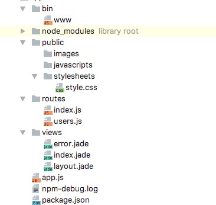

##express    小app应用

###安装express生成器工具
```
 npm install express-generator -g
 ```
 ###生成express应用
 ```
 express myapp
 ```
 ###下载模块以及启动应用
 ```
 npm install
 DEBUG=myapp npm start
 ```
 生成的express应用如下目录：
 